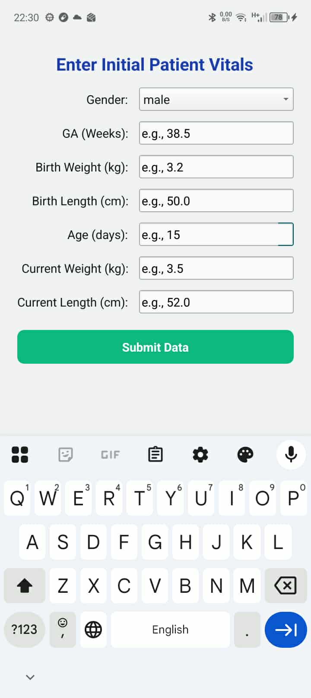
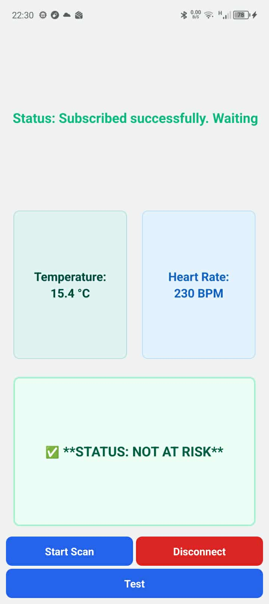
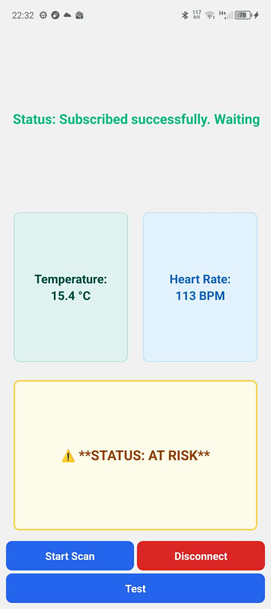

  
  
  

<h1> Welcome to this Android app built with qt. </h1>
<h3>This app is for monitoring data in real time coming from an esp32-cam using bluetooth low energy. And predicts health risks using a machine learning model executed using onnx runtime built for android.</h3>
The gui is built using only c++. We have two interfaces (giuwindow and fff classes).  
The app is communicating with an esp32-cam using ble (bluetooth low energy) technology. 
The esp32-cam gets the sensors information from an esp8266, you can find the code for both boards here:  
The app is using a machine learning model to predict wether the baby is in good health or not. 
It is using the onnx runtime built for android, you can find it here : https://github.com/oussamaelwefi/onnx_runtime_for_android 
You can find the training notebook here : https://github.com/oussamaelwefi/esp32_ble_qt/tree/main 
This is how the app looks like :  

  
  
  

